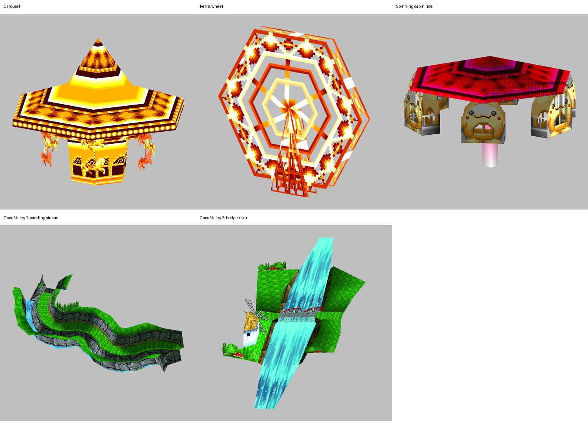

# Course actor identities

Identified from segment-2 display lists, their segment-3 resources, and canonical
GLB previews assembled using the source renderers' component transforms. These
are asset inspections, not gameplay captures. The one-matrix teacup bumper is a
separate actor.

Inspection renders use orthographic projection and the preview mesh textures;
they do not reproduce the game's filtering, fog, or blending.

## Dizzy Land

| Previous renderer | New renderer / public actor | Display-list evidence |
| --- | --- | --- |
| `renderRaceCourseTripleParticle` | `renderDizzyLandCarousel` / `DizzyLandCarouselActor` | `0x0200C1C8`: gold peaked canopy and center column. `0x0200C6A0` / `0x0200C7D8`: alternating groups of three horse-and-pole textured quads. |
| `renderDizzyLandTrailingParticle` | `renderDizzyLandFerrisWheel` / `DizzyLandFerrisWheelActor` | `0x0200CC20`: upright hexagonal wheel with spokes and rim. `0x0200CE48`: triangular support. The hub is translated by `(0, 240, -1)` model units. |
| `renderRaceCourseSpinningObject` | `renderDizzyLandSpinningCabinRide` / `DizzyLandSpinningCabinRideActor` | `0x0200CFB0`: pink canopy carrying face-decorated cabin quads. `0x0200D3A8`: pink center pole. The canopy is translated upward 256 model units. |

The carousel's horse groups bob oppositely while all three parts share its yaw.
The Ferris wheel turns about local Z after its placement yaw. The cabin ride
spins about Y and has small sinusoidal X/Z tilts; `pitchPhase` and `rollPhase`
name those oscillator phases. “Spinning cabin ride” describes the visible model
without claiming an official attraction name.

Update/init functions, public types, component matrices, position/orientation
data, asset symbols, and linker mappings use these identities together. Struct
offsets, initialization, motion, and draw order are unchanged.

## Grass Valley water

`render/update/initCourseWaterLayer`, `RaceCourseWaterLayerActor`, and
`gCourseWaterLayerEntries` replace the billboard names. These meshes are in world
coordinates and do not face the camera. The renderer copies `sourceVertices` to
`scrolledVertices` and adds `textureScrollT` to T; updates subtract `0x40` and
mask with `0x7FF`.

| Task ID / constant suffix | Vertex source / count | Setup / geometry display lists | Visual identity |
| --- | --- | --- | --- |
| 0 / `BIG_SNOWMAN` | `0x02000000` / 6 | `0x02000060` / `0x02000088` | Big Snowman's water mesh, using the shared implementation. |
| 1 / `GRASS_VALLEY_WINDING_STREAM` | `0x0200BA10` / 24 | `0x0200BB90` / `0x0200BBB8` | Narrow winding stream along the rocky channel. |
| 2 / `GRASS_VALLEY_BRIDGE_RIVER` | `0x0200BC00` / 12 | `0x0200BCC0` / `0x0200BCE8` | Broad river beneath the red bridge beside the windmill. |

Constants have the prefix `COURSE_WATER_LAYER_`. The two Grass Valley meshes
occupy separate course locations. Their model-space XYZ bounds are respectively
`(-5536, -1532, -3820)..(-2546, -1186, -2313)` and
`(-13366, -10063, -26162)..(-12451, -9484, -21504)`.
Both use race-effect sprite entry 3. Terrain context distinguishes them.

## Paint-menu border

Still unresolved. Static candidates do not identify the producer of the native
X=0..8 fragment. A runtime capture must correlate its draw commands with the
executing callback and active menu state. No border correction or semantic
rename follows from this asset inspection. No recomp changes were made. See
[the existing investigation](upstream-decomp-contracts.md#paint-menu-border-investigation).
